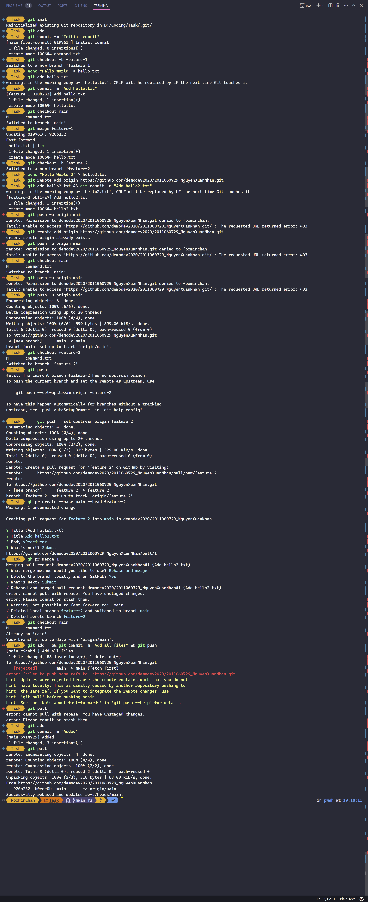

# Danh sách các lệnh đã thực hiện

```bash
# Khởi tạo dự án
git init

# Thêm tất cả các file vào git
git add .

# Commit
git commit -m "Initial commit"

# Tạo và chuyển sang branch mới
git checkout -b feature-1

# Thêm file mới
echo "Hello World" > hello.txt

# Thêm file mới vào git
git add hello.txt

# Commit
git commit -m "Add hello.txt"

# Chuyển về branch main
git checkout main

# Merge branch feature-1 vào main
git merge feature-1

# Tạo nhánh mới từ main
git checkout -b feature-2

# Thêm file mới
echo "Hello World 2" > hello2.txt

# Thêm remote repository
git remote add origin https://github.com/demodev2020/2011060729_NguyenXuanNhan.git

# Thêm và commit file mới
git add hello2.txt && git commit -m "Add hello2.txt"

# Chuyển về branch main
git checkout main\

# Thêm account github khác vào remote repository
#  [Hình ảnh minh hoạ]

# Push code lên remote repository
git push -u origin main

# Chuyển về branch feature-2
git checkout feature-2

# Push code lên remote repository
git push -u origin feature-2

# Tạo pull request từ branch feature-2 vào main
gh pr create --base main --head feature-2

# Merge pull request
gh pr merge 1

# pull code mới nhất từ remote repository
git pull

```

# Hình ảnh lịch sử thực hiện các lệnh



# Thêm account github khác vào remote repository


